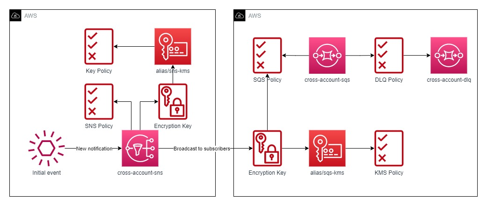

# SNS e SQS cross account

Simulação de envio de mensagens entre contas, o diagrama abaixo detalha o fluxo proposto que este repositório provisiona.



O princípio "least privilege" foi seguido conforme boas práticas sugeridas pelo "AWS Well-Architected Framework". Todas as peças estão com KMS habilitada para evitar vazamento de dados.

Para executar os arquivos terraform é necessário renomear o arquivo `terraform.tfvars.example` para `terraform.tfvars`, os valores de `sns_account` e `sqs_account` também precisam ser alterados para duas contas distintas.

Os módulos sqs e sns estão utilizando perfis diferentes para o provisionamento nas contas, a execução não será concluída com sucesso caso esses perfis não estejam criados no arquivo `.aws\credentials` da home do usuário.

Arquivo credentials de exemplo:

```YAML
[default]
aws_access_key_id = access_key_default
aws_secret_access_key = default_secret_access_key

[sqs_account]
aws_access_key_id = sqs_account_access_key
aws_secret_access_key = sqs_account_secret_access_key

[sns_account]
aws_access_key_id = sns_account_access_key
aws_secret_access_key = sns_account_secret_access_key
```

Links para leitura:

- https://registry.terraform.io/providers/hashicorp/aws/latest/docs
- https://docs.aws.amazon.com/sns/latest/dg/sns-send-message-to-sqs-cross-account.html
- https://docs.aws.amazon.com/sns/latest/dg/subscribe-sqs-queue-to-sns-topic.html#SendMessageToSQS.sqs.permissions
- https://aws.amazon.com/blogs/compute/encrypting-messages-published-to-amazon-sns-with-aws-kms/